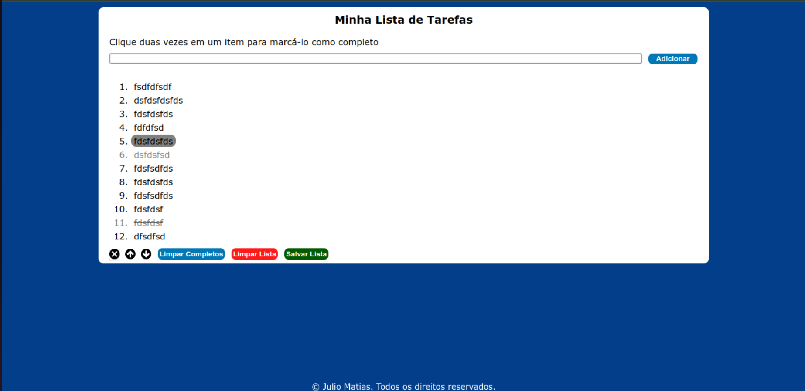

# Welcome To Do List Repository

  
<strong>Summary</strong>

This was a project developed in the fundamentals module at [trybe](https://www.betrybe.com/).\
It was developed in HTML and script.js and style.css files. Pixel Art is a web page application where you can paint pixels and develop your imagination. Feel free to create and promote improvements by creating a fork pull request.

## Opening Application

  
<strong>Browser</strong>

copy the repository to a local folder using the terminal and passing the command:

`git clone git@github.com:juliomatiastrybe/todo-list-js.git`

If you don't have git installed, you can install it using this command in the shell and bash terminal:

Debian/Ubuntu bash:
`apt-get install git`

other kernel follow the instructions on the website [Git](https://git-scm.com/download/linux).

windows/powershell:
`winget install --id Git.Git -e --source winget`

Or you can follow the website [git](https://git-scm.com/downloads) documentation for more installation means.

navigate to the folder created in the clone, and open the terminal.

install the dependencies:

`npm install, pnpm install or yarn install`

you need to have node installed to be able to install the dependency packages
If you don't have it, you can run the command if your operating system is Linux:

`sudo apt update sudo apt install nodejs sudo apt install npm`

If not, follow the installation instructions on the [Node.js](https://nodejs.org/en/download) website.

Still in the terminal, open the application in the browser:

`npm run dev`

using this command application will open in the browser.

  
<strong>Url</strong>

  If you want an option to view the application more easily and quickly, click on [ToDoList](https://juliomatiastrybe.github.io/project-todo-list/)

## Technology used

  
<strong>See about</strong>

  

  
  
  
  

